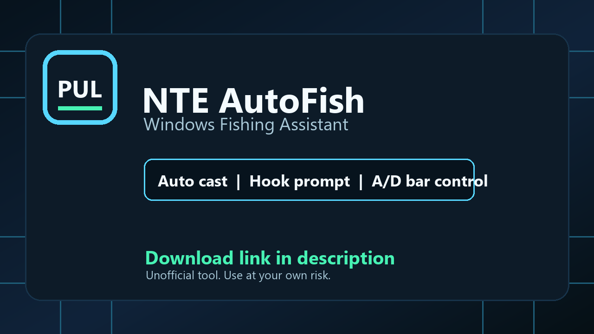

# NTE AutoFish

NTE: Neverness to Everness 向けの Windows 釣り支援ツールです。

[](#最新アップデート)
[](#推奨環境)
[](#推奨環境)
[](https://www.youtube.com/watch?v=0h5MJfFbXqk)
[](https://cilabworks.lemonsqueezy.com/checkout/buy/33197307-b8af-4bfd-b07a-3355cbcce4b6)
[](../../issues)
[](LICENSE.md)
[](#免責事項)

[](https://www.youtube.com/watch?v=0h5MJfFbXqk)

[LemonSqueezyで購入 / ダウンロード](https://cilabworks.lemonsqueezy.com/checkout/buy/33197307-b8af-4bfd-b07a-3355cbcce4b6)
| [itch.io マーケットプレイスページ](https://ranats.itch.io/nte-autofish)
| [デモ動画](https://www.youtube.com/watch?v=0h5MJfFbXqk)
| [X / Twitter](https://x.com/PixelUtilityLab/status/2052105671139803640)
| [English guide](README.md)

NTE AutoFish は、画面認識で釣りUIを読み取り、キャスティング、魚が掛かった表示、釣りバー操作、リザルト画面からの復帰を支援する Windows 向けツールです。

## 最新アップデート

現在のリリース: `v0.1.1`  
最終更新日: 2026-05-10

- 釣果リザルト画面の検出とクローズ再試行を改善しました。
- 餌切れ通知や海釣りメニュー検出時に、安全に入力を止める挙動を追加しました。
- 通常のキャスト待機画面を餌切れ通知として誤検出しにくくしました。
- NTEウィンドウが前面にない場合の自動アクティブ化と、対象ウィンドウを確認できない場合の入力ブロックを改善しました。
- 設定時にNTEウィンドウ範囲を対象にした画面キャプチャを使えるようにしました。
- 表示が一瞬隠れる、または初回入力が通らないケース向けに、キャスト/釣り上げ入力のリトライ挙動を調整しました。

## 主な機能

- `F` キーでキャスティングできる釣り待機状態から自動でキャストします。
- 「魚が掛かった」表示を検出して `F` キーを押します。
- 釣りミニゲーム中、黄色い操作バーが判定ライン付近に留まるように `A` / `D` を短く入力します。
- 釣り上げ後のリザルト画面を閉じ、次のキャスト待機へ戻ります。
- 餌切れ表示や釣りメニューを検出した場合は停止します。
- 実入力前に確認できる dry-run モードを同梱しています。

## 推奨環境

- Windows 10/11
- Python 3.11 以降
- NTE はボーダーレスフルスクリーン推奨
- 1920x1080 以上の解像度
- Windows の表示スケール 100%
- HDR と色補正フィルターはオフ推奨

NTE が管理者権限の入力を必要とする環境では、PowerShell またはコマンドプロンプトも管理者として実行してください。

## 購入前の注意

このツールは Python ベースの Windows ツールです。スマートフォンアプリや単体の実行ファイルではありません。

プログラムは、NTE 内で釣り場に立ち、手動で `F` を押すとキャスティングできる「釣り待機状態」から開始する想定です。

解像度、UIスケール、表示モード、HDR設定、ゲームアップデート、アンチチート挙動、アカウント環境によって動作が変わる場合があります。購入前にデモ動画と推奨環境を確認してください。

主な購入ページ:

`https://cilabworks.lemonsqueezy.com/checkout/buy/33197307-b8af-4bfd-b07a-3355cbcce4b6`

マーケットプレイス側の予備ページ:

`https://ranats.itch.io/nte-autofish`

このプロジェクトでは LemonSqueezy を主な直接購入ページとして扱います。itch.io はマーケットプレイス上の掲載ページ、および利用可能な場合の代替ダウンロード導線です。決済、領収書、返金、ダウンロードリンクに関する問い合わせは、購入したストア側のサポート導線を使ってください。

## 購入後の流れ

配布ZIPには以下が含まれます。

- `install.bat`
- `dry_run.bat`
- `run.bat`
- 英語/日本語の開始ガイド
- 調整用の `settings.json`

基本的な流れ:

```powershell
install.bat
dry_run.bat
run.bat
```

手動コマンドで実行する場合:

```powershell
python -m nte_autofish run --config .\settings.json
```

終了するときは `Ctrl+C` を押してください。

## サポート

セットアップで問題がある場合は、このリポジトリの GitHub Issue に以下を添えて投稿してください。

- Windows バージョン
- Python バージョン
- 解像度と表示スケール
- NTE をボーダーレスフルスクリーンで実行しているか
- どの画面で自動化が止まるか

決済、領収書、返金、ダウンロードリンクに関する問い合わせは、購入したストア側のサポート導線を使ってください。

公開Issueには、個人情報、購入レシート、UID が映ったスクリーンショットを投稿しないでください。

## 免責事項

このツールは非公式の自動化ツールです。Hotta Studio、Perfect World Games、YouTube、GitHub、itch.io、LemonSqueezy、X、Neverness to Everness の公式製品ではありません。

ゲームプレイの自動化は、ゲームの利用規約に抵触する可能性があります。利用は自己責任で行ってください。ゲームアップデート、UI変更、アンチチート変更、アカウント制限、非対応の表示設定などにより動作しなくなる場合があります。
